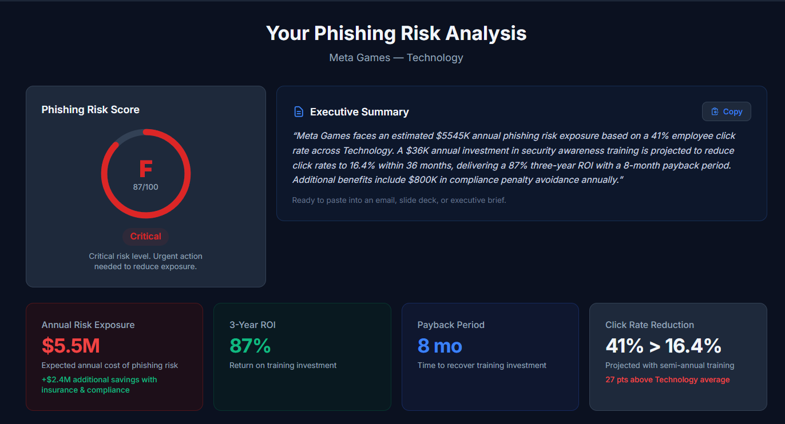
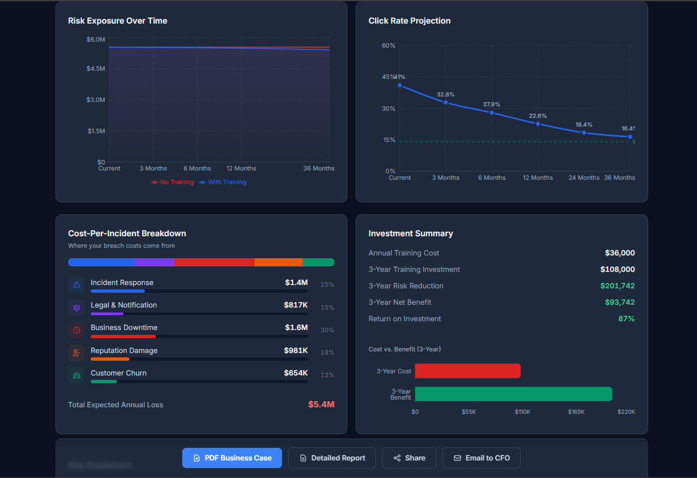

# Phishing Simulation ROI Calculator

A free, interactive tool that quantifies phishing risk exposure and calculates the return on investment for security awareness training. Built for CISOs, security teams, and IT leaders who need data-backed business cases to secure training budgets.

**[Try the Live App](https://phishing-simulation-roi-calculator.vercel.app/)**

---

## Screenshots

### Risk Analysis Dashboard

### Charts and Cost Breakdown

---

## What It Does

Enter your organization's profile (industry, employee count, current phishing click rate, training budget) and the calculator instantly generates:

- **Phishing Risk Score** with letter grade (A through F) based on a 100-point scale
- **Annual Risk Exposure** in dollars, broken down by incident response, legal, downtime, reputation, and customer churn costs
- **3-Year ROI Projection** showing how training investment pays back over time
- **Click Rate Projection** charting the expected decline in employee click rates month by month
- **Executive Summary** ready to paste into emails, slide decks, or board presentations
- **Key Talking Points** for presenting to the CFO with one-click copy
- **What-If Scenarios** with live sliders to adjust breach cost and click rate assumptions
- **Scenario Comparison** to save and compare multiple configurations side by side
- **PDF Export** in two formats: a concise business case and a detailed technical report
- **Shareable Link** with QR code for quick access on other devices

## How It Works

The calculator uses a **Poisson probability model** to estimate breach likelihood based on the number of employee compromises per year. Cost projections are derived from industry-specific data:

- **IBM Cost of a Data Breach Report 2024** for per-incident cost benchmarks
- **Verizon Data Breach Investigations Report 2024** for attack vector frequencies
- **KnowBe4 Phishing Benchmarking Data** for click rate baselines by industry
- **SANS Institute** and **Osterman Research** for training effectiveness rates

Training effectiveness decay curves model how click rates change over time based on training frequency (annual, semi-annual, quarterly, or monthly), with diminishing returns built into the projection.

## Tech Stack

| Layer | Technology |
|-------|-----------|
| Frontend | React 18, Vite 6, Tailwind CSS 3 |
| Charts | Recharts |
| PDF Export | jsPDF, html2canvas |
| QR Codes | qrcode (client-side generation) |
| Hosting | Vercel |

### Key Engineering Decisions

- **Dark/light theme system** using CSS custom properties in RGB space-separated format with Tailwind's `<alpha-value>` opacity support. One set of semantic tokens (`surface`, `heading`, `body`, `muted`, `divider`) drives both themes without duplicating component styles.
- **All computation runs client-side.** No backend API calls, no user data leaves the browser. The server is just static file serving with security headers.
- **Code splitting** with React.lazy and Suspense. The results dashboard, Recharts, and jsPDF are separate lazy-loaded chunks, keeping the initial bundle under 40KB gzipped.
- **URL parameter sharing** with input validation (NaN rejection, range clamping, enum whitelists) to prevent injection through shareable links.
- **Keyboard accessible** segmented controls with roving tabIndex and Arrow key navigation following WAI-ARIA radiogroup patterns.

## Features at a Glance

- 8 industry verticals with calibrated breach costs and compliance frameworks
- Animated number transitions on all metric cards
- Sensitivity analysis showing optimistic, base, and pessimistic scenarios
- Social proof counter tracking total analyses generated
- Skeleton loading states during dashboard hydration
- Mobile-responsive layout with stacked export buttons on small screens
- Escape key dismisses QR modal
- Print-friendly styles
- Security headers (HSTS, X-Frame-Options, CSP, Referrer-Policy)

## Authors

**William Asare Yirenkyi** and **Shweta Limje**

---

[Try the Live App](https://phishing-simulation-roi-calculator.vercel.app/)
